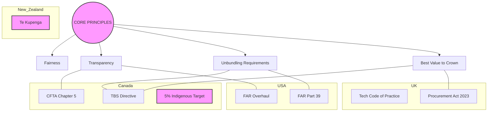

# Procurement Knowledge Graph & Visualizations

This document provides a visual representation of the repository's information architecture.

## 1. Core Relationship Mind Map



## 2. Digital Lifecycle Comparison

```mermaid
graph LR
    subgraph USA_TechFAR
        US_Pre[Agile Teams] --> US_Sol[Modular Design] --> US_Ev[Demos]
    end

    subgraph Canada_TBS
        CAN_Pl[Investment Planning] --> CAN_Un[Unbundling] --> CAN_It[Iterative/Phased]
    end

    US_Sol <--> CAN_Un : "Modular/Small Team Alignment"
```
