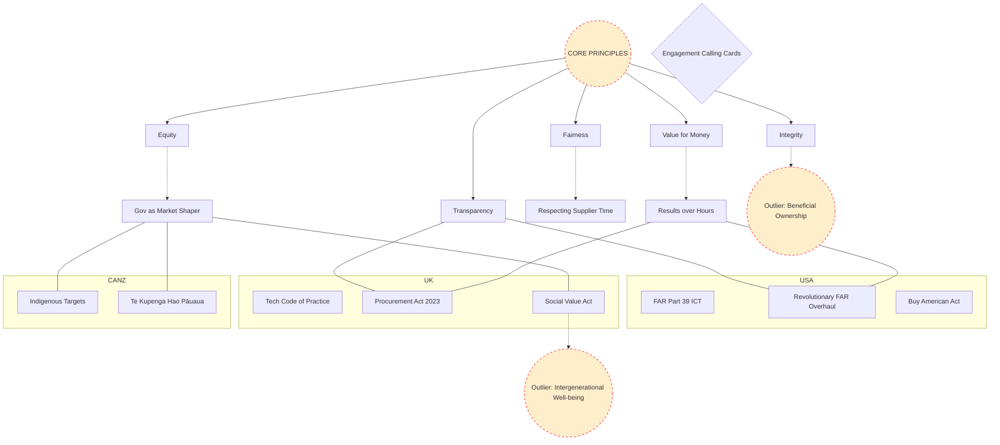

# Procurement Knowledge Graph & Visualizations

This document provides a visual representation of how the various concepts, regulations, and regional policies in this repository fit together.

## 1. Core Relationship Mind Map

This diagram links the core principles to regional implementations and identifying outliers.



## 2. Digital Lifecycle Comparison

A comparison of how the US and UK define the path to "Better Procurement."

```mermaid
graph LR
    subgraph TechFAR Hub (USA)
        US_Pre[Pre-Solicitation: Agile Teams]
        US_Sol[Solicitation: Modular Design]
        US_Ev[Evaluation: Demos/Comparative]
        US_Adm[Administration: Quality Assurance]

        US_Pre --> US_Sol --> US_Ev --> US_Adm
    end

    subgraph TCoP / Act 2023 (UK)
        UK_Needs[Define User Needs]
        UK_Open[Open Standards/Source]
        UK_Flex[Competitive Flexible Procedure]
        UK_Cloud[Cloud First / Social Value]

        UK_Needs --> UK_Open --> UK_Flex --> UK_Cloud
    end

    %% Inter-connections
    US_Sol <--> UK_Open : "Open Standards Consensus"
    US_Ev <--> UK_Flex : "Agile Evaluation Alignment"
```

## 3. How to Read This Map

- **Nodes**: Represent the concepts and datasets defined in the `docs/*.yamlld` files.
- **Subgraphs**: Group regional specific regulations.
- **Outliers (Orange Dotted)**: Highlight concepts like **Intergenerational Well-being** that are emerging but not yet part of the global regulatory consensus.
- **Arrows**: Indicate "Flows into" or "Supports."
- **Dash Lines**: Indicate conceptual relationships rather than direct regulatory mandates.
