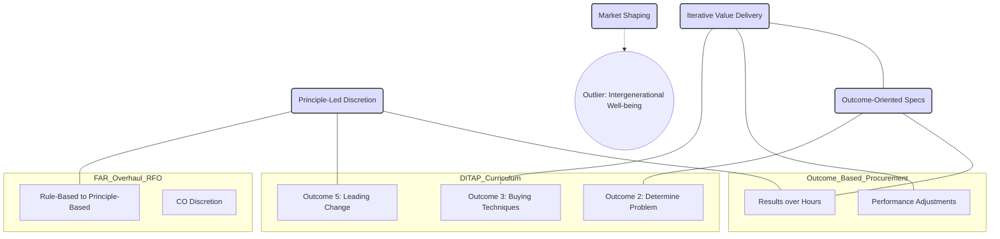

# Procurement Knowledge Graph & Visualizations

## 1. The Conceptual Bridge (Linking RFO, OBP, DITAP)

This diagram shows how abstracted "Bridging Approaches" connect specific regulatory and training frameworks.



## 2. Digital Lifecycle Comparison

```mermaid
graph LR
    subgraph TechFAR_Hub_USA
        US_Pre[Agile Teams] --> US_Sol[Modular Design] --> US_Ev[Demos]
    end

    subgraph TCoP_UK
        UK_Needs[User Needs] --> UK_Open[Open Standards] --> UK_Flex[Flexible Procedure]
    end

    US_Sol <--> UK_Open : "Shared Interoperability Goal"
```
