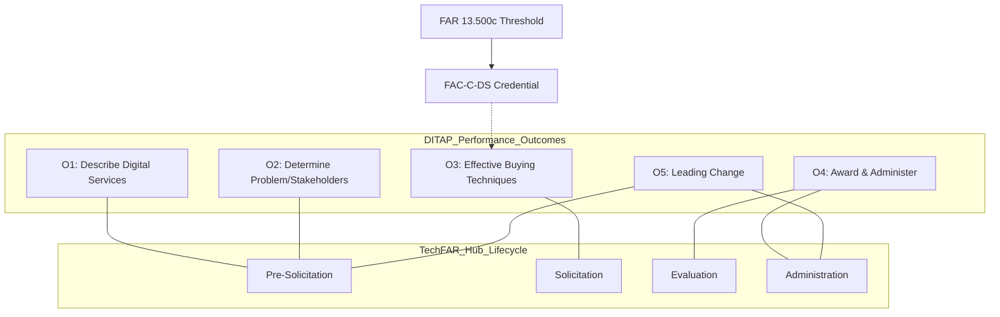
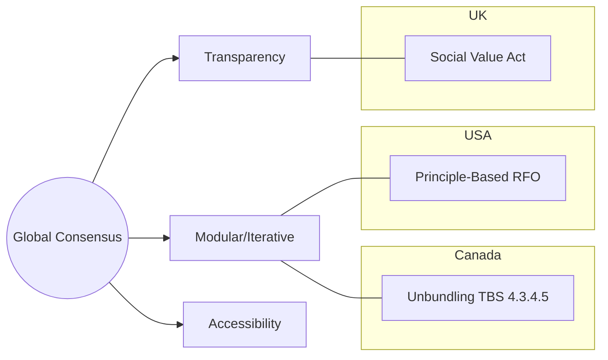

# Procurement Knowledge Graph & Visualizations

## 1. DITAP Competency & Lifecycle Map

```mermaid
graph TD
    subgraph TechFAR_Hub_Lifecycle
        Pre[Pre-Solicitation]
        Sol[Solicitation]
        Ev[Evaluation]
        Adm[Administration]
    end

    subgraph DITAP_Performance_Outcomes
        O1[O1: Describe Digital Services]
        O2[O2: Determine Problem/Stakeholders]
        O3[O3: Effective Buying Techniques]
        O4[O4: Award & Administer]
        O5[O5: Leading Change]
    end

    O1 --- Pre
    O2 --- Pre
    O3 --- Sol
    O4 --- Ev
    O4 --- Adm
    O5 --- Pre
    O5 --- Adm

    %% Mandates
    M1[FAC-C-DS Credential]
    T1[FAR 13.500c Threshold]

    T1 --> M1
    M1 -.-> O3
```

## 2. Global Consensus vs regional Levers

```mermaid
graph LR
    %% Consensus
    C((Global Consensus))
    Transparency[Transparency]
    Modularity[Modular/Iterative]
    Accessibility[Accessibility]

    C --> Transparency
    C --> Modularity
    C --> Accessibility

    %% Regional
    subgraph USA
        RFO[Principle-Based RFO]
    end
    subgraph UK
        SocialValue[Social Value Act]
    end
    subgraph Canada
        Unbundling[Unbundling TBS 4.3.4.5]
    end

    Modularity --- RFO
    Modularity --- Unbundling
    Transparency --- SocialValue
```
